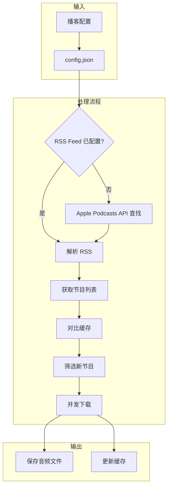
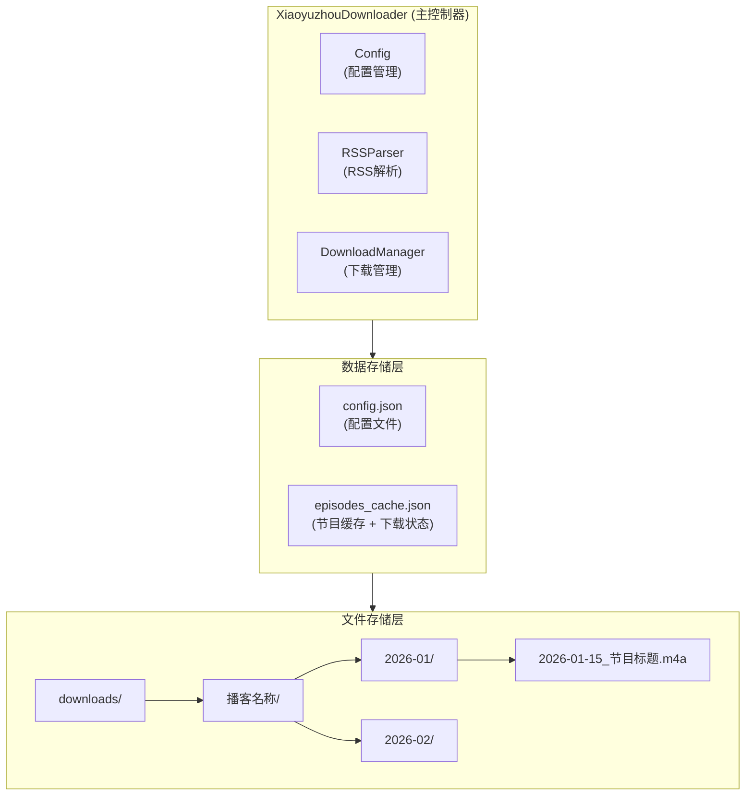
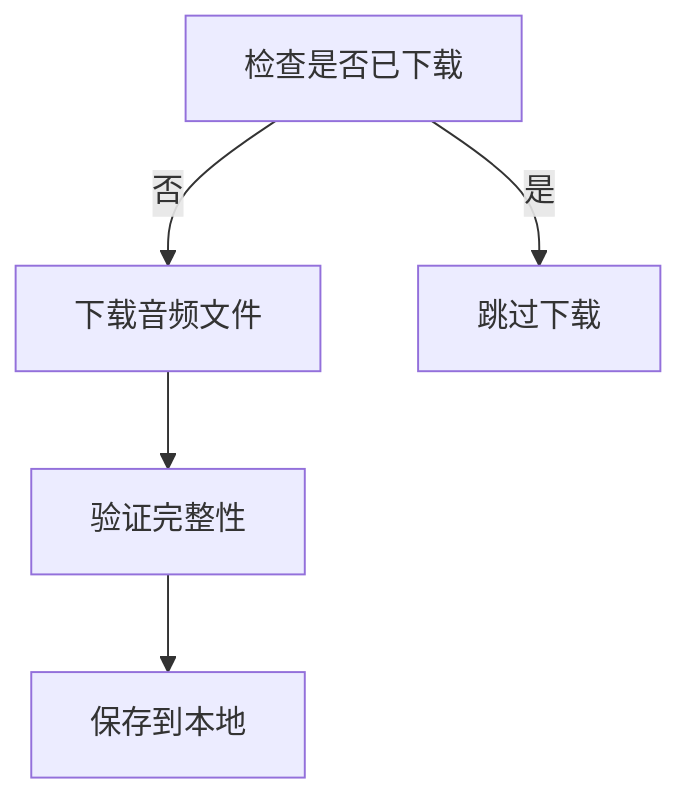

# 小宇宙播客下载器 (Xiaoyuzhou Podcast Downloader)

一个功能完善的播客下载工具，支持下载小宇宙平台上的所有播客节目。

## 功能特性

- **完整下载**: 通过 RSS Feed 获取完整的节目列表，不受小宇宙平台 API 限制
- **增量更新**: 只下载新发布的节目，避免重复下载
- **断点续传**: 自动检测已下载的文件，支持中断后继续下载
- **自动分类**: 按年月自动分类存放音频文件
- **并发下载**: 支持多线程并发下载，提高效率
- **自动查找 RSS**: 通过 Apple Podcasts API 自动查找播客的 RSS Feed
- **配置管理**: 支持配置多个播客，批量下载

## 设计思路

### 系统工作流程



### 架构设计



### 核心模块

#### 1. RSSParser (RSS 解析器)

由于小宇宙平台没有公开的分页 API，页面只能显示最新的 15 期节目。通过研究发现，大多数播客在喜马拉雅等平台有同步发布，这些平台提供完整的 RSS Feed。

**RSS Feed 发现流程**:


#### 2. DownloadManager (下载管理器)

**去重机制**:
- 检查文件是否存在
- 验证文件大小（避免下载不完整的文件）
- 使用 GUID 作为唯一标识

**下载流程**:



#### 3. Config (配置管理)

使用 JSON 格式的配置文件，支持:
- 多播客配置
- 下载参数自定义
- 运行时参数覆盖

### 文件命名规则

```
{日期}_{标题}.{扩展名}
例如: 2026-03-14_索尼音频｜咖啡豆：汉堡肉搭配米饭的日系快餐.m4a
```

### 目录结构

```
downloads/
├── 声动早咖啡/
│   ├── 2021-07/
│   ├── 2021-08/
│   ├── ...
│   ├── 2026-02/
│   ├── 2026-03/
│   └── episodes_cache.json
├── 另一个播客/
│   └── ...
└── config.json
```

## 安装

### 方式一：直接使用

```bash
# 克隆仓库
git clone https://github.com/your-username/xiaoyuzhou-downloader.git
cd xiaoyuzhou-downloader

# 安装依赖
pip install -r requirements.txt

# 创建配置文件
python xiaoyuzhou_downloader.py --init
```

### 方式二：pip 安装（即将支持）

```bash
pip install xiaoyuzhou-downloader
```

## 使用方法

### 基本命令

```bash
# 下载所有已配置的播客
python xiaoyuzhou_downloader.py

# 只下载新节目（增量更新）
python xiaoyuzhou_downloader.py --only-new

# 列出所有已配置的播客
python xiaoyuzhou_downloader.py --list

# 创建默认配置文件
python xiaoyuzhou_downloader.py --init
```

### 添加播客

```bash
# 通过 RSS URL 添加
python xiaoyuzhou_downloader.py --add "播客名称" --rss "https://www.ximalaya.com/album/xxxxx.xml"

# 通过小宇宙 URL 添加（自动查找 RSS）
python xiaoyuzhou_downloader.py --add "播客名称" --url "https://www.xiaoyuzhoufm.com/podcast/xxxxx"
```

### 高级选项

```bash
# 指定下载目录
python xiaoyuzhou_downloader.py --download-dir "/path/to/downloads"

# 指定并发线程数
python xiaoyuzhou_downloader.py --workers 5

# 指定配置文件路径
python xiaoyuzhou_downloader.py --config "/path/to/config.json"
```

## 配置说明

编辑 `config.json` 文件：

```json
{
    "podcasts": [
        {
            "name": "播客名称",
            "rss_url": "RSS Feed URL（可选）",
            "xiaoyuzhou_url": "小宇宙播客 URL（可选）"
        }
    ],
    "download_dir": "./downloads",    // 下载目录
    "max_workers": 3,                  // 并发下载线程数
    "retry_times": 3,                  // 下载失败重试次数
    "retry_delay": 5,                  // 重试间隔（秒）
    "request_timeout": 30,             // 请求超时时间（秒）
    "download_timeout": 120,           // 下载超时时间（秒）
    "check_updates": true,             // 是否检查更新
    "auto_update_days": 1              // 自动更新间隔（天）
}
```

### 如何找到播客的 RSS Feed

#### 方法一：通过 Apple Podcasts

1. 访问 [Apple Podcasts](https://podcasts.apple.com/)
2. 搜索播客名称
3. 复制播客链接，格式类似 `https://podcasts.apple.com/podcast/idxxxxx`
4. 使用 Apple iTunes API 获取 RSS:
   ```
   https://itunes.apple.com/lookup?id=xxxxx&entity=podcast
   ```
5. 在返回的 JSON 中找到 `feedUrl` 字段

#### 方法二：通过喜马拉雅

1. 在喜马拉雅搜索播客名称
2. 找到对应的专辑页面
3. RSS URL 格式为: `https://www.ximalaya.com/album/{专辑ID}.xml`

#### 方法三：通过小宇宙

1. 在小宇宙 APP 或网页找到播客
2. 复制播客链接，格式为 `https://www.xiaoyuzhoufm.com/podcast/{播客ID}`
3. 本工具会自动通过 Apple Podcasts API 查找对应的 RSS Feed

## 定时更新

### Linux/macOS (cron)

```bash
# 编辑 crontab
crontab -e

# 每天早上 8 点检查更新
0 8 * * * cd /path/to/xiaoyuzhou-downloader && python xiaoyuzhou_downloader.py --only-new
```

### Windows (Task Scheduler)

1. 打开"任务计划程序"
2. 创建基本任务
3. 设置触发器为"每天"
4. 操作为"启动程序"
5. 程序路径: `python`
6. 参数: `xiaoyuzhou_downloader.py --only-new`
7. 起始位置: 工具所在目录

## 常见问题

### Q: 为什么只能下载 15 期节目？

小宇宙平台的网页只显示最新的 15 期节目，API 也有访问限制。解决方案是通过 RSS Feed 获取完整列表，大多数播客在喜马拉雅等平台有同步发布。

### Q: 如何获取播客的 RSS Feed？

请参考上面的"如何找到播客的 RSS Feed"章节。如果播客没有在其他平台发布，可能无法获取完整列表。

### Q: 下载中断了怎么办？

直接重新运行下载命令即可，工具会自动跳过已下载的文件。

### Q: 如何只下载最新的节目？

使用 `--only-new` 参数，工具会对比缓存中的节目列表，只下载新节目。

## 技术栈

- **Python 3.8+**
- **requests**: HTTP 请求
- **xml.etree.ElementTree**: XML 解析
- **concurrent.futures**: 并发下载

## 贡献

欢迎提交 Issue 和 Pull Request！

## 许可证

MIT License

## 免责声明

本工具仅供个人学习和研究使用，请勿用于商业目的。下载的音频文件版权归原作者所有。